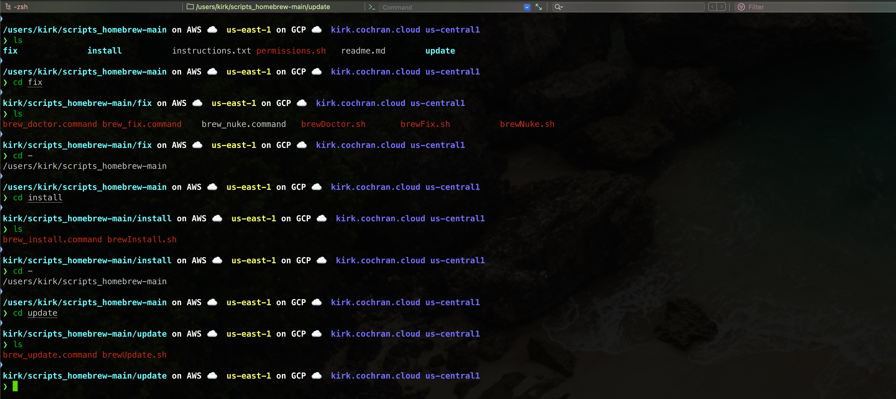

# BAM 3.1
## Verify Homebrew Installation and Scripts

### 1. Point CLI to your Desktop,

 
 
*Note: My Homewbrew is installed in my user home directory, not desktop. This step shows the directory that contains the scripts_homebrew-main folder.**

### 2. List the folder and subfolder contents of the homebrew scripts folder (“scripts_chocolatey” for Windows, “scripts_homebrew” for Mac, /sbin for Linux)

